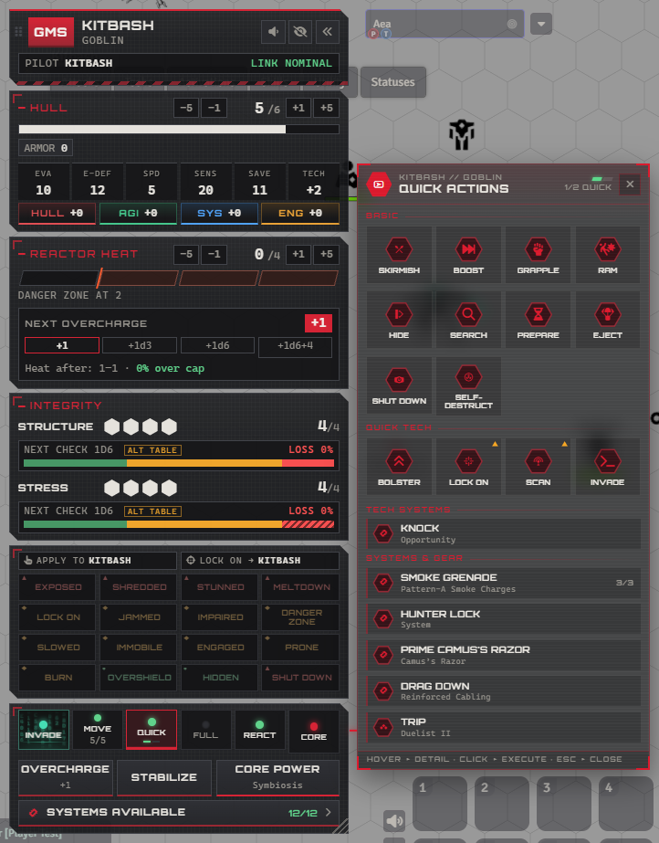
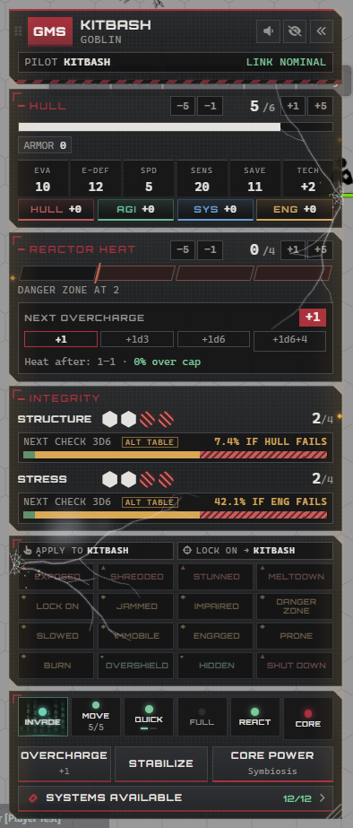
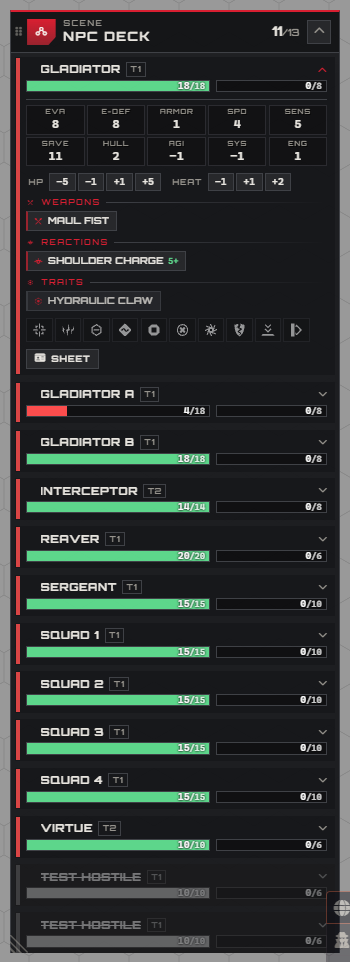
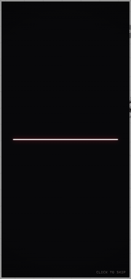

# Flight Deck: cockpit HUD for LANCER

A docked instrument panel for your mech in Foundry VTT. It shows what the sheet buries,
reacts to the rules as they happen, and makes short synthesized sounds that only you hear.

- **Foundry:** v13 (verified 13.351)
- **System:** LANCER 3.1+ (verified 3.1.3)
- **Assets:** none. The visuals are CSS and inline SVG, and every sound is synthesized with the Web Audio API.
- **Optional:** [Token Magic FX](https://foundryvtt.com/packages/tokenmagic) for the silhouette effects of Exposed, Shredded, Jammed and Impaired. Everything else works without it.

| The panel with the QUICK menu | After structure and stress damage | The GM's NPC Deck |
|---|---|---|
|  |  |  |

## Install

1. In Foundry's setup screen, open **Add-on Modules** and click **Install Module**.
2. Paste this into **Manifest URL** at the bottom and click **Install**:
   ```
   https://github.com/Auxila/lancer-flight-deck/releases/latest/download/module.json
   ```
3. In your LANCER world, open **Game Settings → Manage Modules**, tick **Flight Deck**, and save.

Hosted servers (The Forge, Molten and others) take the same manifest URL. Foundry checks it for updates, so new releases show up under **Update** in Add-on Modules.

The panel is opt-in for each player: the first time a player logs in with a mech, they're asked once. Anyone can turn it on later with **Alt+C** or in **Configure Settings**. GMs get the NPC Deck from the chessboard button in the token controls, or with **Alt+N**.

## Before your first session

Ten minutes in a copy of your world (or a test world) shows everything a cautious GM wants to see:

1. Enable **Flight Deck** in **Game Settings → Manage Modules**. Nothing appears for players yet: the panel is off until each player turns it on.
2. Log in as a player (or ask one), select their mech and accept the offer, or press **Alt+C**. The boot sound plays if audio is on.
3. Roll a **HULL** check from the panel and open a HUD menu, such as **QUICK**, and run **Search**. Both go through LANCER's own prompts and chat cards.
4. As GM, take one structure off that mech: the player's panel cracks. Put it back.
5. Click the eye-slash button in the panel header to hide it, then bring it back with the gauge button in **Token Controls**. Every player can do this mid-session.
6. Open the mech sheet: it's untouched. Flight Deck reads the actor and runs LANCER's flows; it doesn't replace anything.

**Removing it cleanly.** Apart from ordinary game changes you make through it (HP, heat, conditions, the action tracker), Flight Deck saves only two things: Token Magic filters on tokens (ids starting `lfd-`) and a small flag recording which reactions were used this round. Turn off the world setting **Condition effects on token art** first to remove the filters, then untick Flight Deck in **Manage Modules**.

## What it shows

| Section | Contents |
|---|---|
| Header | Manufacturer badge, mech and frame, pilot callsign, comms link status, your activation |
| Hull | HP with overshield, armor, burn, Evasion / E-Def / Speed / Sensors / Save / Tech, and HULL / AGI / SYS / ENG check buttons |
| Reactor heat | One segment per point of heat, the Danger Zone boundary, the Overcharge ladder, and the odds that the next Overcharge pushes you over your Heat Cap |
| Integrity | Structure and stress pips. Each track shows the next check's dice, the exact chance of every outcome, and the chance of losing the mech |
| Master caution | 16 fixed annunciator tiles: warnings ▲, cautions ◆, advisories ●. Shape and border style repeat the colour's meaning |
| Actions | Action lights that open the HUD menus (INVADE, MOVE, QUICK, FULL, REACT, CORE), Overcharge, Stabilize and Core Power buttons that run the system's own flows, and SYSTEMS AVAILABLE |

Example: a mech at 2/4 structure shows `Next check 3d6 · Loss 42.1%`. The breakdown is 34.7% Direct Hit and 7.4% Crushing Hit; a Direct Hit is fatal with one structure left. `npm test` checks these numbers against brute-force enumeration.

## Cold boot

Every time the panel opens or expands from its collapsed tab (and at combat start, and after Boot Up), it boots, in about three seconds:



1. A CRT power-on line snaps across the middle.
2. A terminal log pours down the panel, faster and faster: this mech's firmware, POST checks, every mounted weapon (ARMED), every system (ONLINE), reactor and heat cap, structure and stress, pilot handshake, between memory dumps, with a counter racing to 100%.
3. A hard cut: white flash and a scanline sweep.
4. The finish: **MAIN SYSTEM** / **COMBAT MODE** tracking in with a chromatic split, a segment bar, corner brackets, and an **ENGAGED** stamp. It holds for a beat, a light running along the bar and the stamp pulsing.
5. The overlay parts like blast doors and the plates power on top to bottom.

Synthesized sound follows the same timeline: data chatter, a thunk on the cut, a rising sweep and a two-tone chime on ENGAGED. Selecting another mech boots it once a session. A click skips it, **Cold boot sequence** in Configure Settings turns it off, and with reduced motion it's a still title card for a moment.

## Cockpit events

| Event | Visual | Sound |
|---|---|---|
| Heat enters the Danger Zone | Heat plate glows, DZ tile lights | 1.8 s turbine spool-up, then an optional hum that fades within ~12 s |
| Stress lost | Stress track flashes, the panel browns out; with cracks, steam blows out of them | 2.5 s of Geiger clicks; a soft hiss if the glass is cracked |
| Structure lost | The glass fractures (see Battle damage), the panel kicks | Low impact thud and a crackle of breaking glass |
| Lock On, Exposed, Stunned, Shredded | Tiles light and flash | Two-tone caution chime |
| Reactor meltdown (`meltdown_timer` or the Reactor Meltdown status) | Tile shows `T-n` | One klaxon cycle |
| Jammed | Static and scanlines over the comms strip | — |
| Shut Down / Boot Up | Instruments drop to emergency power / the cold boot | Data chatter, then the ENGAGED chime |
| Core Power spent | CORE ONLINE banner | Rising sweep |

New alerts flash hard for about 4 seconds, then ease off by 10 seconds and settle to steady lit for as long as the condition lasts. Re-renders don't restart the fade. With the panel collapsed, the tab shows a ▲ or ◆ that fades the same way.

### Audio discipline

Audio is built for tables that talk over Discord:
- Cues are short and only fire on events.
- Each cue has a cooldown, so stacked updates make one sound.
- A limiter prevents clipping.
- Cues are dropped, not queued, while the browser's audio lock is closed.
- Everything plays on Foundry's interface audio context, so the **Interface** volume slider controls it.
- Each player has their own mute and volume.

## Battle damage

The panel wears the mech's damage, and it stays there until it's repaired.

- **Structure: the glass fractures.** Each structure point lost strikes a new impact on the
  panel's bezel: a hot flash and shockwave ring, sparks, a split-second RGB tear across the
  readouts, and the panel kicks. A spider-web fracture forms at the impact, cracks race
  inward and branch, burn amber and cool to pale glass over a second or so, and glass shards
  drop off. A few stuck pixels stay lit near each impact. The cracks remain until structure
  is repaired, when they zip closed back toward their impacts and fade.
- **Stress: the power falters.** Each point lost drains colour from the plates, lights
  another amber LED on the bezel and brings up a faint amber emergency wash; each hit browns
  the panel out for a moment. At the last point the LEDs turn red and the power flickers now
  and then.
- **Both low: steam.** Once the glass is cracked and stress is at half or below, steam vents
  through the cracks: jets that brake, billow and rise, in hissing bursts with quiet wisps
  between. It vents harder at the last stress point and harder again at the last structure.
- **Readability.** Impacts sit on the bezel and cracks stop short of the panel's far side.
  Crack lines are blended so they can only brighten what's under them, never darken it, and
  steam is translucent; every readout stays legible.
- **Every mech cracks its own way.** The fractures are generated from the mech's id and the
  structure point lost, so the same mech always shows the same damage, across reloads,
  without anything being saved.
- Only real changes animate: opening the panel, reloading or switching mechs draws the
  damage as it stands. Collapsed, the tab shows a small crack and a stress LED. Reduced
  motion shows all the damage without animating any of it.
- To inspect it frame by frame:
  `game.modules.get("lancer-flight-deck").api.damageClock.setScale(0.1)` slows the damage
  timers and steam to a tenth. Slow the CSS to match with DevTools > Animations.

## HUD menus

Every light on the action bus is a button. Click one and a translucent HUD opens beside the
panel's bottom plate, in the current theme's colours. One menu is open at a time; click the
light again, press Esc or use × to close it. Right-click a light (QUICK, FULL, REACT, MOVE)
to mark that slot spent, or available again; Shift+right-click REACT does the same for the protocol.

| Light | Menu |
|---|---|
| INVADE | Fragment Signal and every invade option from your systems, frame and talents, with Tech Attack, Sensors and your current target. The button itself is a live terminal: hex rain, a scan line and a short glitch every few seconds. It goes quiet when no quick action is left. |
| MOVE | Movement modes your token can use (walk, climb, jump, teleport…), set on the token so the ruler measures them, plus Boost, Disengage and a movement reset |
| QUICK | Skirmish, Boost, Grapple, Ram, Hide, Search, Prepare, Eject, Shut Down, Self-Destruct; quick tech (Bolster, Lock On, Scan, Invade); then every quick and quick-tech action from your gear |
| FULL | Barrage, Improvised Attack, Stabilize, Disengage, Boot Up, Mount, Jockey, Full Tech; then every full and full-tech action from your gear |
| REACT | Protocols and reactions. On top, every protocol your frame, systems and talents give you, marked PROTOCOL READY or USED. Below, Brace and Overwatch, then every reaction your frame, systems, weapons, talents and core bonuses give you. The light's lamp is your reaction; its PROTO line lights while the protocol is still available this turn. |
| CORE | Core power and passive, frame traits, and free actions including Overcharge |

**SYSTEMS AVAILABLE**, under the Overcharge / Stabilize / Core Power buttons, opens the same
HUD listing every installed system with its state (ready, Limited uses, destroyed, cascading).
Clicking a system posts its **full text** to chat: type, SP and uses, the effect, every action
(activation, heat, frequency, trigger and effect, never collapsed), the deployables it creates
with their stats and actions, and its tags, in LANCER's own chat styling. Flavor text is left
out; a system whose only rules text is its description shows that instead.
That's information only: it never spends a Limited use or applies heat (LANCER's own system
card prints only the effect, so gear that keeps its rules in actions came out nearly empty).
Frame traits and the core passive post their actions too.

- **Hover** (or focus with the keyboard) any entry for its full rules text at once: trigger,
  effect, heat cost, uses, tags. Gear text is the LCP's own; basic actions carry a short
  paraphrase. The card stays up for as long as the pointer rests on the entry, even when
  the menu redraws underneath it; **middle-click** pins it (Foundry's tooltip lock) so you
  can move onto it to read long text, and moving away dismisses it.
- **Click** to run it through LANCER's own flows, so cards, rolls, heat, Limited uses and
  Loading are the system's:
  - attacks open LANCER's attack HUD (Skirmish, Barrage and Overwatch first ask which mounted
    weapon; a Barrage takes two);
  - tech actions and invades roll tech attacks against E-Defense;
  - Lock On puts the condition on your targets (through the GM for enemies, as with the tile),
    Scan uses LANCER's Scan database, Hide / Shut Down / Boot Up set the status on your mech,
    Self-Destruct starts the meltdown countdown;
  - everything else posts its card to chat.
- **Action economy.** When an action goes through (a cancelled attack doesn't count), its slot
  is marked spent on LANCER's action tracker, using LANCER's own rules: a quick action uses the
  full action first, a full action uses both. The world setting **HUD menus spend actions**
  chooses: only in an active combat (default), always, or never.
- **Reactions** follow both limits: LANCER's tracker (one reaction per turn), and each reaction
  once per round. A reaction taken from the HUD shows USED until the next round.
- **Keyboard:** arrow keys move between entries, Enter runs one, Esc goes back or closes.
- The HUD flips to the panel's other side when there's no room (for example docked right),
  scales with the panel, and follows it when you drag or scroll it.

Two LANCER quirks the HUD works around: LANCER's basic attack flow titles every card
"BASIC ATTACK", and an actor-level tech attack with any title other than "TECH ATTACK" rolls
against Evasion. Grapple, Ram, Improvised Attack and Fragment Signal get their real titles
and the right defence, without changing LANCER's flows for anyone else.

## Mech checks

Under the stat strip (EVA, E-DEF, SPD, SENS, SAVE, TECH) sit four check buttons: **HULL** (red), **AGI** (green), **SYS** (blue) and **ENG** (amber). Each shows the mech's bonus, such as `HULL +2`, and carries its label, so colour is never the only cue.

Clicking one rolls that check through LANCER's own check flow, exactly like the mech sheet: LANCER's accuracy and difficulty prompt opens, then the roll posts to chat. Hovering shows the formula and what the check is for. The buttons are disabled on mechs you don't own.

## Weapon actions and mounts

Skirmish, Barrage and Overwatch open a weapon picker that follows LANCER's mount rules:

- **Superheavy** weapons only fire in a Barrage, and take the whole Barrage: elsewhere they're dimmed with the reason, and clicking one explains why.
- After the main attack(s) the picker turns into an **Auxiliary follow-up** step listing only the weapons that may still fire: a different Auxiliary on the same mount after a Skirmish or Overwatch, and one Auxiliary on each mount that fired after a Barrage (never one that already fired). **Done** ends the action.
- Only the first attack spends the action; a Barrage's second attack and every follow-up are free. **Done** ends the action at any point once something has fired; weapons that can't fire (destroyed, unloaded, out of uses) are barred with the reason. Follow-ups deal no bonus damage, which the picker reminds you of; LANCER's attack prompt is where you leave it off.

## Damage after a hit

When an attack you make hits or crits at least one target, LANCER's damage roll prompt opens by itself, as if you'd pressed ROLL DAMAGE on the attack card (which stays there for re-rolls). It works for attacks from anywhere: the HUD, the sheet, macros.

- Every target is in the one prompt with its result already chosen: **Crit**, **Hit** or **Miss** (a Reliable weapon's misses still take their Reliable damage).
- An area attack (Blast, Burst, Line, Cone) is one attack, so it opens one prompt for all its targets.
- Several attacks in a row (a Barrage, for one) queue their prompts: the next opens when you roll or cancel the current one, so no damage roll is ever replaced by the next.
- Per player: turn it off in Configure Settings (**Roll damage after a hit**), for example as a GM rolling NPC attacks.

## NPC Deck (GMs)

The Flight Deck is a cockpit for one mech; a GM runs a whole enemy force. The NPC Deck is
the GM's board for it: one slim row per NPC, docked on the side away from the Flight Deck
(right by default), toggled from the token controls or with **Alt+N** (which then
collapses and expands it). Players never see it.

- **Initiative strip:** across the top, everyone in the combat, players and NPCs, as
  portraits in three groups: **acting** (lit and breathing), **still to act** (with their
  LANCER activation pips), and **done** this round (greyed, ticked). The header sums it up
  (`▶ Interceptor · 9 to act · 3 done`). Players come first in each group. Big fights switch
  to smaller portraits. Portraits show each combatant's token art, as on the map: an image set
  on the combatant, else the token (its dynamic-ring art if any), else the actor's portrait,
  skipping LANCER's placeholder icons when real art exists. Animated tokens show a still
  frame; a combatant with no art at all shows a mech or NPC glyph in its side's colour.
  - **Hover** a portrait: a big animated red "look here" marker lands on that token on the
    map (sonar ripples, a turning dashed ring, chevrons pointing in). If the token is off
    screen, a red arrow on the edge of the map points to it with its name. Only you see it.
  - **Click** a portrait: selects the token, exactly as clicking it on the map would (Shift
    adds to the selection). **Double-click** looks at it. **Right-click** starts that
    combatant's turn (LANCER's popcorn initiative).
- **The roster:** the started combat's NPCs in turn order (destroyed ones sink to the
  bottom), or, with no combat, every NPC token on the scene. Unlinked copies of the same NPC
  are separate rows with their own health and conditions.
- **It follows you:** the open row follows the turn, and your selection. Select an NPC on
  the map and its row opens and scrolls into view; select one that isn't in the combat and
  it appears at the top, marked "Not in combat". The deck stays open throughout.
- **Move and resize it like the Flight Deck:** drag the header to float it anywhere, drop it
  at a screen edge to dock it again (or use the pin), and drag the corner grip to scale it
  (70–160%, double-click to reset, arrow keys when focused). Layout is saved per GM.
- **Each row:** a disposition stripe (hostile, neutral, friendly, secret), name, tier and
  template, HP and heat bars, structure and stress pips when it has more than one,
  its conditions as lit badges in the panel's colours (red for Stunned, Exposed and Shredded;
  amber for Lock On, Jammed, Slowed and the like; green for Hidden), Burn and Overshield,
  LANCER activations left this round, and a
  crosshair with a marker in each player's colour for **every player targeting it**.
  Hovering a row puts the same "look here" marker on its token as hovering its portrait.
  Whoever's turn it is glows; NPCs that have already acted this round dim. A row flashes
  red when its NPC takes damage, and kicks when it loses structure.
- **One row opens at a time** (selecting an NPC's token opens its row), whoever's turn it is
  unless you open another:
  - its stats, and **HULL / AGI / SYS / ENG** keys in the panel's colours that roll the
    check through LANCER, as from the sheet;
  - HP / heat steppers;
  - a grid of labelled condition tiles (Lock On, Jammed, Impaired, Slowed, Immobile, Stunned,
    Exposed, Shredded, Prone, Hidden). They light like the panel's annunciator when on, and a
    click toggles one;
  - its features as buttons (Weapons, Tech, Systems, Reactions, Traits, with Recharge and
    Limited state);
  - **Activate** / **End turn** (LANCER's popcorn initiative), Recharge, and the sheet.
- **Features:** hover for the full text with its numbers at the NPC's tier (attack,
  accuracy, range, damage). Click to use it through LANCER's own flows (attack, tech attack,
  or its card, with Limited, Recharge and heat handled by the system); right-click posts its
  text without using it.
- **Rows:** click a name to select the token and look at it (Shift adds to the selection),
  double-click for the sheet; hovering a row lights its token on the map.

### Several NPCs at once

Select two or more NPC tokens on the map (drag a box, or shift-click tokens or initiative portraits) and a **batch bar** appears at the top of the deck:

- HP and heat steps apply to every selected NPC, each one exactly as if you'd stepped its own row. When several NPCs drop to 0 HP (or go over their heat cap) at once, their structure (or overheat) checks open one after another, since LANCER only keeps one such prompt open; a notice says whose check is next.
- Condition tiles show whether none, some (half-lit) or all of the selection have it. A click gives it to the ones without it; when all have it, a click removes it from all. The hover card says how many have it.
- The × clears the selection.

### Several targets

Attacks with several targets go to LANCER's attack HUD, which handles each target (and
its Lock On) separately. Actions the rules aim at **one** character (Lock On, Scan and the
basic invade) need exactly one target: with several, the HUD says so and does nothing, so no
condition or action is wasted. Readouts list every target's Evasion or E-Defense in target
order (`10/8/12`).

## Moving, resizing and editing

- **Move.** Drag the header (the grip, badge or empty header space) to float the panel anywhere. Drop it near the left or right screen edge, where dashed targets appear, to dock it again, or use the pin button. Floating positions are saved per player and stay on screen when the window resizes.
- **Resize.** Drag the grip in the bottom corner. The whole panel scales evenly from 70% to 160%, so the instruments stay in proportion. Double-click the grip to reset, use the arrow keys when it's focused, or set **Panel size** in settings.
- **Hull and Reactor Heat.** Each value has −5 / −1 / +1 / +5 buttons, and the number itself is a field:
  - type `7` to set it, `+3` / `-4` to adjust, or `=-2` to force an absolute value
  - Enter applies and Esc cancels
  - rapid clicks merge into a single update, and the new value shows immediately
- **HP and heat edits use the system's own automation.** HP may go below 0, because LANCER carries the overflow into the next structure. HP at or below 0 starts the Structure flow, and heat over the cap starts the Overheat flow.

## Condition tiles

Every annunciator tile is a button. A strip above the grid shows who each kind of click will hit:

- **Apply to:** every condition except Lock On goes to your **selected** token(s). With nothing selected, it goes to the mech on the panel. Targeted tokens are ignored.
- **Lock On →:** Lock On goes to your **targeted** token(s) (press T over a token). With no target, it falls back to your selection, then the panel's mech.

When the recipient isn't the mech on the panel, small rings mark the tiles it already has.

| Tile | Click | Right-click | Shift+click |
|---|---|---|---|
| Status tiles (Exposed, Jammed, Stunned…) | Toggle. Across several tokens: remove if all have it, otherwise add | — | — |
| Lock On | Toggle on your target(s) | — | — |
| Burn, Overshield | +1 | −1 | Clear |
| Hidden | Toggle Hidden | Toggle Invisible | — |
| Meltdown | Start a countdown (asks for turns) or clear it | Tick down one turn | — |

**Players and enemies.** Players can only select tokens they own, so they can only condition their own mech. The single exception is **Lock On**. A player's Lock On on an enemy is applied by the active GM through v13's built-in user queries (no socketlib), and the GM side refuses any other request for an unowned token. The world setting **Players can Lock On tokens they do not own** turns the exception off.

**Structure and Overheat prompts.** When HP is edited to 0 or below, or heat over the cap, LANCER starts its own Structure or Overheat flow. LANCER shows that prompt to the mech's **owning player** when one is online, and to GMs only otherwise. If you're a GM and the prompt went to a player, the panel tells you who has it.

## Condition effects on tokens

Every condition has its own look on the token itself. Three techniques, each matched to its job:

| Condition | Effect | How |
|---|---|---|
| Exposed | The frame burns red-hot; the silhouette stays readable | Token Magic FX: red adjustment + fire + pulsing glow |
| Shredded | Constant white smoke billowing along the outline | Token Magic FX: xglow aura |
| Jammed | Bright electricity crawling over the frame, art visible | Token Magic FX: electric (screen blend) + blue glow |
| Impaired | Every ~3 s a short surge: arcs crawl over the frame, an amber rim glow swells and the image glitches with an RGB split, then it goes quiet. Weaker than Jammed | Token Magic FX: electric + glow + rgbSplit, synced |
| Prone | The token art tips 90° onto its side, with a short fall | Local rotation of the art |
| Slowed | A web on the ground under the base, strands tightening on the lower body | Drawn overlay |
| Immobile | Two chains run from shackles on the hull to stakes in the ground. They take turns yanking taut: the links rattle and reel in, a spark flies at the shackle, the stake shudders and kicks up dust, then the chain sags back on a spring | Drawn overlay |
| Lock On | Red targeting brackets that slam in, then breathe | Drawn overlay |
| Stunned | Sparks orbiting the crown | Drawn overlay |
| Engaged | Clash chevrons pushing in from both sides | Drawn overlay |
| Hidden | A slow dotted perimeter | Drawn overlay |
| Shut Down | The frame dims; a red standby light blinks | Drawn overlay |
| Reactor Meltdown | A radiation badge with the T-n countdown, beating faster near zero | Drawn overlay |

- **Token Magic filters** follow the art's silhouette. They're saved on the token, so exactly **one** client writes them: the active GM, or the first active owner if no GM is online. That client reconciles the token's own `lfd-` filters against its conditions, so nothing doubles up, nothing hits a permission error, and a player's Lock On applied by the GM still updates correctly. It listens to document hooks, so it keeps working while the GM's Foundry is a background tab.
- **Drawn overlays and Prone** are rendered on each client from the token's conditions. Nothing is saved, so they need no permissions and can't go stale. They sit above the art but under Foundry's bars and status icons.
- **Lancer QoL** keeps its own visuals for Burn, Overshield, Danger Zone, Invisible, Intangible and Cascading. For Jammed, the world setting **Jammed effect** picks Flight Deck's electricity (default) or QoL's version; with Flight Deck chosen, QoL's darkening Jammed filter is removed where both would stack.
- **Settings:** "Condition effects on tokens" and "Condition effect strength" are per player. "Condition effects on token art" is per world and removes the saved filters when turned off. Reduced motion freezes the overlays on a still frame.

## Controls and settings

- **Alt+C** turns the panel on, then collapses and expands it. You can rebind it in Configure Controls.
- **Panel header:** the speaker button mutes audio, the eye-slash button hides the panel completely, and the chevrons collapse it to a slim tab that still shows heat and structure.
- **Token Controls:** the **Flight Deck** toggle (gauge icon) turns the panel on and off for every player. It's the one-click way back after hiding it.
- Client settings, which are per player: show panel, dock side, theme, panel size, opacity, reduce motion, cold boot, audio, volume, and Danger Zone afterglow.
- World settings: offer the panel to each player once when they first log in with a mech (opt-in; nobody is forced), whether players can Lock On tokens they don't own, and when HUD menus spend actions.

The panel follows the last mech token you control. If you aren't controlling one, it falls back to your assigned character (or your pilot's active mech).

## Compatibility

Checked against the modules LANCER tables commonly run, by testing and by reading their code:

- **LANCER Alternative Structure:** while it's active, the structure and stress odds use its tables and carry an **ALT TABLE** tag. Under those tables no single roll destroys the mech; a failed HULL or ENGINEERING check decides, shown as `+x% more if the check fails`. Losing the last point still ends the mech.
- **Lancer QoL:** its wreck automation deletes a destroyed NPC's token and combatant, so that NPC leaves the NPC Deck and the initiative strip. Wrecking also clears Token Magic filters, Flight Deck's included. QoL keeps its own Danger Zone visuals; the world setting **Jammed effect** picks Flight Deck's or QoL's Jammed.
- **Token Action HUD:** works alongside. Actions run from Token Action HUD don't spend slots on LANCER's action tracker (neither does the sheet); actions run from Flight Deck's HUD menus do, as the world setting says. Its bar sits behind a left-docked panel, so while the panel is open on your mech the bar is hidden; collapse or hide the panel and it's back. **Hide Token Action HUD while open** in Configure Settings turns that off (then drag the bar somewhere clear).
- **LANCER Weapon FX:** animations play for attacks made from Flight Deck.
- **Lancer Speed Provider:** its extra movement modes appear in the MOVE menu.
- **LANCER Alternative Sheets, Enhanced LANCER Status Effects, Ilysen's NPC rebake:** no conflicts found.
- **Token Magic FX:** optional.

## Layout

The panel docks inside Foundry's own UI columns instead of floating:
- **Left dock:** beside the scene controls.
- **Right dock:** beside the sidebar, above the chat notifications.

It measures the hotbar, players list and chat input, and caps its own height above them. It scrolls internally instead of covering them.

## Architecture

```
src/
  index.js                     hooks, API (game.modules.get("lancer-flight-deck").api)
  constants.js                 ids, status ids (note: Slowed is "slow")
  settings.js                  client/world settings
  core/
    FlightDeckManager.js       lifecycle, actor resolution, partial re-render, events
    TelemetryAdapter.js        LANCER actor -> snapshot, snapshot diff -> events
    ConditionControl.js        tile clicks -> status/counter/meltdown ops, GM query handler
    SynthesizerEngine.js       Web Audio cues on game.audio.interface
    Odds.js                    exact check/overcharge maths (pure, Node-testable)
  themes/
    BaseTheme.js, GMSTheme.js, registry.js
  actions/
    basic.js                   LANCER's basic actions: menu, icon, slot, how each runs
    catalog.js                 every action from equipped gear, weapons, hover cards
    menus.js                   HUD view models (JSON-safe) + what each entry does
    runner.js                  runs entries through LANCER flows; action economy rules
    chatCards.js               full-text chat cards for systems, traits and core passives
  npc/
    NpcDeck.js                 the GM's NPC Deck (frameless ApplicationV2)
    NpcRoster.js               who's in play, initiative, row and feature view models, cards
    LookHere.js                the "look here" marker on the map (PIXI, this client only)
  ui/
    FlightDeckPanel.js         frameless ApplicationV2, docking, overlays
    HudMenu.js                 the HUD menus beside the panel
    HoverCards.js              full-text hover cards on Foundry's tooltip (HUD, NPC Deck)
    DeckFrame.js               docked / floating placement, drag to move, grip to resize
    damage/
      fracture.js              seeded fracture geometry, damage levels (pure, Node-testable)
      DamageLayer.js           cracks, impacts, stress lights, brownouts, mending
      SteamField.js            canvas steam venting through the cracks
      clock.js                 the effects' clock (slow motion for inspection)
    components/*.js            view models per section
templates/panel/*.hbs          one Handlebars part per section
templates/hud/menu.hbs         every HUD menu
styles/flight-deck-base.css    layout, instruments, effects
styles/hud.css                 action buttons, INVADE terminal, HUD menus, hover cards
styles/damage.css              battle damage
styles/npc.css                 the NPC Deck
templates/npc/deck.hbs         the NPC Deck
styles/themes/gms.css          GMS palette and ornaments
```

Each section is an ApplicationV2 part, and only the parts whose data changed re-render.

## Adding a manufacturer theme

1. Subclass `BaseTheme` with `id`, `label`, `badge`, `manufacturers` (frame manufacturer codes, for example `["HA"]`), `audio` and `bootLines()`.
2. Add `styles/themes/<id>.css` that sets the `--lfd-*` variables on `.lfd-theme-<id>`, then list it in `module.json`.
3. Register it in `themes/registry.js`, or from another module with `api.registerTheme(MyTheme)`. Its `bootLines()` lead the cold boot's terminal stream, and `audio.boot` tunes the ENGAGED chime.
4. Optionally override individual part templates with `static templates = { heat: "..." }`.

Frames whose manufacturer has no theme use GMS.

Canon manufacturer colours from Massif's lancer-data:

| Manufacturer | Light | Dark |
|---|---|---|
| GMS | `#991E2A` | `#db1a2d` |
| IPS-N | `#0c4d99` | `#1c9ae8` |
| SSC | `#b57e07` | `#d1920a` |
| HORUS | `#046e3c` | `#00a256` |
| HA | `#6e4373` | `#a15ea8` |

## Development

```bash
npm test
```

`npm run smoke` drives a running world in a headless browser: a player seat and a GM seat exercise the panel, every HUD menu, the check buttons, hiding, the NPC Deck and battle damage, then put back everything they changed. Use a test world, close the seats it logs into, and point it at your server:

```bash
FD_URL=http://localhost:30000 FD_GM="Gamemaster" FD_PLAYER="Player" FD_MECH="Everest" npm run smoke
```

It needs `playwright-core` (`PLAYWRIGHT_CORE` can point at an existing install) and a browser (`FD_EXECUTABLE`, `FD_BROWSER=firefox`). A step fails only on errors thrown from Flight Deck's own code: errors from other modules are counted but don't fail anything, and errors that name no package are listed for you to look at.

The tests cover the odds maths against brute-force enumeration, the action-economy rules, the fracture geometry and damage levels, NPC feature states and token portraits. The UI was verified in a real Foundry 13.351 server with LANCER 3.1.3, in Chromium and Firefox, with no other modules active.

### Releasing

1. Bump `version` in `module.json` (and `package.json`), and add a section to `CHANGELOG.md`.
2. `npm run package` builds `dist/module.json` and `dist/lancer-flight-deck.zip` with only the files Foundry needs, and moves the `download` URL to the new version's tag.
3. Commit, push, and publish both files as a GitHub release tagged `v<version>`:
   ```bash
   gh release create v0.4.1 dist/module.json dist/lancer-flight-deck.zip --notes-file CHANGELOG.md
   ```

The manifest URL always points at the latest release's `module.json`, so installed copies pick the update up.

## Licence

MIT, see [LICENSE](LICENSE).

### Lancer notice

"Flight Deck" is not an official *Lancer* product; it is a third party work, and is not
affiliated with Massif Press. "Flight Deck" is published via the *Lancer* Third Party License.
*Lancer* is copyright Massif Press.
